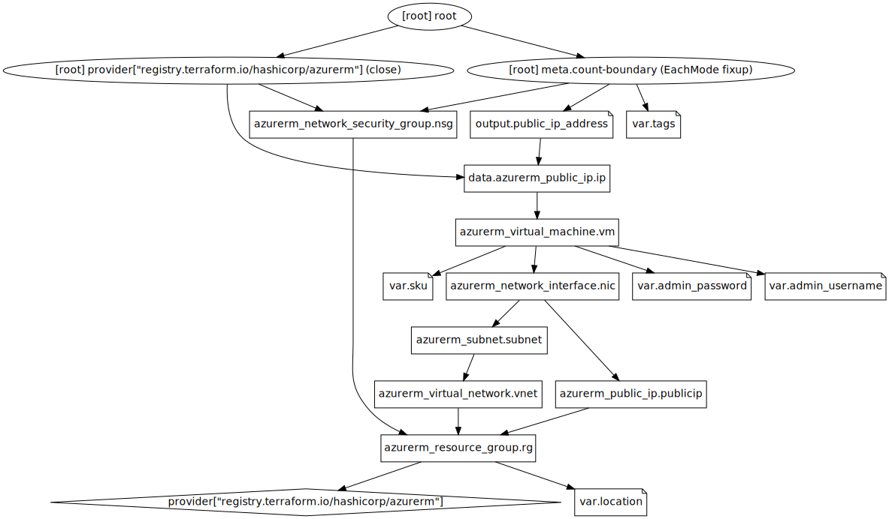

# Create resource dependencies

|expected time|requirements                                    |
|-------------|------------------------------------------------|
|30 minutes   |A computer with Terraform installed, lab 7 done.|

Goal: Learn how dependecies work in Terraform.

## Explanation

Terraform [calculates dependencies](https://www.terraform.io/docs/internals/graph.html) by itself.

In this example it's quite clear what needs to happen first and what second:

```hcl
resource "azurerm_resource_group" "rg" {
  name     = "rg-robertdebock-sbx"
  location = var.location
  tags = {
    Environment = "Terraform Getting Started"
    Team = "DevOps"
  }
}

# Create a virtual network
resource "azurerm_virtual_network" "vnet" {
    name                = "myTFVnet-robert"
    address_space       = ["10.0.0.0/16"]
    location            = var.location
    resource_group_name = azurerm_resource_group.rg.name
}
```

1. The `azurerm_resource_group` needs to be created.
2. The `azurerm_virtual_network` refers to `azurerm_resource_group.rg.name`, so this resource comes secondly.

You can ask [Terraform to show the dependencies](https://www.terraform.io/docs/cli/commands/graph.html) using `terraform graph`. To make an image, the binary `dot` (in the package `graphviz`) is required.

[](images/graph.svg)

Sometimes Terraform can't calculate the dependencies by itself and needs some help using the `depends_on` argument, something like this:

```hcl
# Many parameters replaced by `...` to make this more readable.

resource "azurerm_virtual_machine" "database" {
  name                  = "database"
  ...
}

resource "azurerm_virtual_machine" "webserver" {
  name                  = "webserver"
  ...
  depends_on = [azurerm_virtual_machine.database]
}
```

In the example above, two virtual machines are created. We as developers may know that the `database` needs to be created first, before the `webserver` is created.
From a Terraforms perspective, these are just two machines with no specific relation. By adding the `depends_on` parameter, Terraform knows it should first create the `database`, followed by the `webserver`.

## Howto

NOTE: There are a few errors in the Azure documentation:

- The password must be `Password1234!`.
- The username must be `plankton`.

- [AWS](https://learn.hashicorp.com/tutorials/terraform/aws-dependency?in=terraform/aws-get-started).
- [Azure](https://learn.hashicorp.com/tutorials/terraform/azure-dependency?in=terraform/azure-get-started).
- [GCP](https://learn.hashicorp.com/tutorials/terraform/google-cloud-platform-dependency?in=terraform/gcp-get-started).

## Demo

## Assignment

- [ ] Follow the instructions in the `Howto`.
- [ ] Count how many implicit dependencies you now have in your code.
- [ ] Count how many explicit dependencies you now have in your code.

## Questions:

1. Does the order of resources in `main.tf` matter?
2. Where do dependecies between resources come from?
3. Can you explain what this means: `resource_group_name = azurerm_resource_group.rg.name`?
4. How can you express a list in [HCL](https://github.com/hashicorp/hcl)?
5. Can you login to the machine you've created?
6. Please change the machine to Ubuntu 18.04. (`sku = 18.04-LTS`)
7. Google for "terraform input sensitive". How can I set an environment variable to prevent me from typing (and seeing) the username and password?
